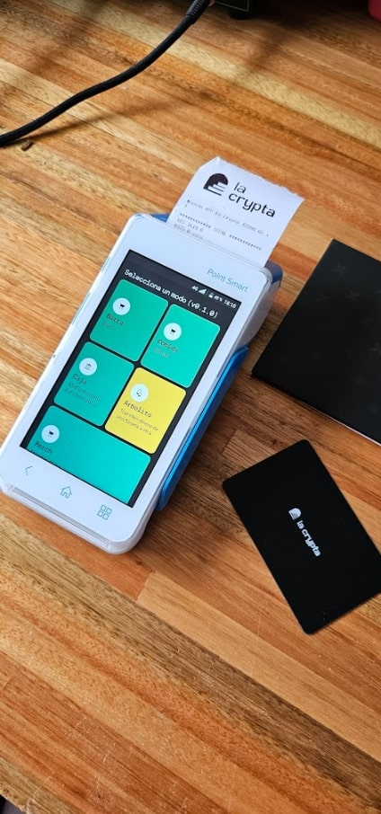
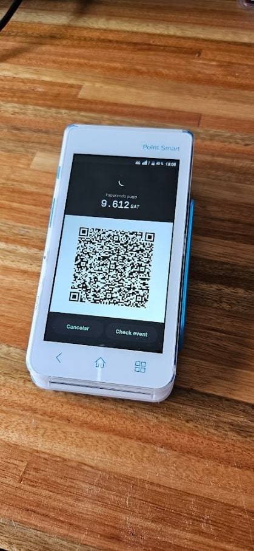

This project is a fork from [github.com/LaWallet.io/mobile-pos](https://github.com/lawalletio/mobile-pos/) with the intention of adapting it to run locally on a MP POS, with the possibility of using the NFC reader and the thermal printer. 


> [!IMPORTANT]
> This project is not related to LaWallet.io, MercadoPago, or PAX Technology. The use of this project is the sole responsibility of whoever executes it.
> Please remember that MP POS devices have usage conditions. This repository does not and will not contain private-use code, nor does it explain how to modify a device, as it violates its usage policies [MP Point TyC](https://www.mercadopago.com.ar/ayuda/terminos-condiciones-point_2772).
> ⚡ The repository only contains the web server code.
> Under no circumstances may the User attempt to repair or otherwise tamper with the Reader.

## Pictures
 

## Getting Started

First, run the development server:

```bash
npm run dev
# or
yarn dev
# or
pnpm dev
# or
bun dev
```

Open [http://localhost:3000](http://localhost:3000) with your browser to see the result.

You can start editing the page by modifying `app/page.tsx`. The page auto-updates as you edit the file.

This project uses [`next/font`](https://nextjs.org/docs/basic-features/font-optimization) to automatically optimize and load Inter, a custom Google Font.

## Learn More

To learn more about Next.js, take a look at the following resources:

- [Next.js Documentation](https://nextjs.org/docs) - learn about Next.js features and API.
- [Learn Next.js](https://nextjs.org/learn) - an interactive Next.js tutorial.

You can check out [the Next.js GitHub repository](https://github.com/vercel/next.js/) - your feedback and contributions are welcome!

## Deploy on Vercel

The easiest way to deploy your Next.js app is to use the [Vercel Platform](https://vercel.com/new?utm_medium=default-template&filter=next.js&utm_source=create-next-app&utm_campaign=create-next-app-readme) from the creators of Next.js.

Check out our [Next.js deployment documentation](https://nextjs.org/docs/deployment) for more details.
